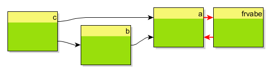

# Degraph Testing Demo

A sample project which uses `degraph-check` to write unit tests that check package dependencies.

The package dependencies of this project look like that:

This project mainly demonstrates
* which project dependencies are needed (Degraph, Hamcrest and JUnit)  
[see [pom.xml](pom.xml)]
* simple usage examples of the Degraph [Java Constraints DSL](http://blog.schauderhaft.de/degraph/documentation.html#java-constraints-dsl)  
[see [PackageDependenciesTest](src/test/java/de/frvabe/PackageDependenciesTest.java)]

**Links**
* [Degraph](http://blog.schauderhaft.de/degraph/)
* Degraph - [Testing of Dependencies](http://blog.schauderhaft.de/degraph/documentation.html#testing-of-dependencies)

**Pro Top**

If you run into an `IllegalArgumentException` while testing your code base, you possibly have the wrong `asm` version on your classpath (see Degraph issue [#82](https://github.com/schauder/degraph/issues/82)). In this case the easiest workaround is to move the degraph tests into a separate module.
