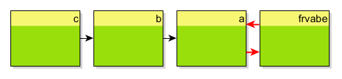
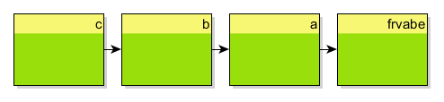

# Degraph Visualization Test

A crucial part of implementing software components is to get your code free from unwanted package dependencies. But most of the time it is hard to get an overview of which code depends on each other. [SonarQube](https://www.sonarqube.org/) is a great tool but unfortunately they dropped the _Package Tangle Index analysis_ support (see _'Also worth noting'_ [here](https://blog.sonarsource.com/sonarqube-5-2-in-screenshots/)). [JDepend](https://github.com/clarkware/jdepend) is another tool but I could not really get familiar with it (even not with the eclipse IDE integration). Thus I decided to try [Degraph](http://blog.schauderhaft.de/degraph/) - a newer tool that I heard of some time ago.

The result is this simple demo project. The goal of this demo is to generate a "component" (package) diagram for the projects source code. Each individual package should be shown with its dependencies to other packages. The content of a package (the classes) should not be shown.

Degraph is able to generate a `.graphml` file that can be rendered with [yEd](http://www.yworks.com/products/yed). And here is the How-To...


The project structure looks like this

```
de
└───frvabe
    │   Exclude.java
    │   Include.java
    │
    ├───a
    │       A1.java
    │       A2.java
    │
    └───b
        │   B1.java
        │   B2.java
        │
        └───c
                C1.java
                C2.java
```

Thus, we have the following packages

```
de.frvabe
de.frvabe.a
de.frvabe.b
de.frvabe.b.c
```

To run Degraph a configuration file has to be provided. The file ([packages.config](src/main/degraph/packages.config)) looks like this

```
output = ../../../target/degraph/packages.graphml
classpath = ../../../target/degraph-visualization-test-0.0.1-SNAPSHOT.jar
include = de.frvabe.**
packages = {
    de.(*).*
    de.frvabe.(*).*
    de.frvabe.b.(*).*
}
```

This configuration will group the code into _slices_. Patterns are used to find classes that belong to the same slice.

> A slicing is a grouping of classes that in some sense belong to each other.

The configuration format is described in the [Degraph documentation](http://blog.schauderhaft.de/degraph/documentation.html#the-configuration-file-format). What you need to understand is that not the _slicinglabel_ (here 'packages') will (necessarily) be a slice in the output. Instead pattern can have _naming parts_ (_'(*)'_) that will build the name of the slice.

For example the `de.frvabe.(*).*` pattern will find all classes with a `de.frvabe.` prefix and a `.*` suffix. In between there is the pattern for the naming part `(*)` (the single star represents an arbitrary number (0-n) of arbitrary characters without dots!). The classes of the packages `de.frvabe.a` and `de.frvabe.b` will match the pattern and be grouped to the slices `a` and `b`. This is exactly what I wanted.

Running Degraph on this project with the above configuration (see [run-degraph.bat](src/main/degraph/run-degraph.bat)) will generate two `graphml` files (because I have two Degraph configuration files). These can be opened with [yEd](http://www.yworks.com/products/yed) to draw the desired diagrams. The Degraph documentation has a short and nice How-To an [working with yEd](http://blog.schauderhaft.de/degraph/documentation.html#working-with-yed).

The following diagram was made with the [packages.config](src/main/degraph/packages.config) configuration. Degraph detected a dependency cycle between two packages.



In the second configuration ([packagesWithExclude.config](src/main/degraph/packagesWithExclude.config)) I excluded a class that causes the dependency cycle and the diagram looks like this now:



Of course you should better fix the code instead of the Degraph configuration but here I wanted to document how to exclude sources from the Degraph analysis ;-)

All in all using **Degraph** with **yEd** is not a "plug and play" solution. A little setup and work has to be done, but in the end the result is remarkable.

Beside just generating diagrams Degraph can also be used to test dependencies during the project build. That helps to keep the code free from unwanted code dependencies (e.g. to enforce rules like 'the business logic code should not depend on the UI code'). I'm already eager to try this feature.

Thanks to:
* [Degraph](http://blog.schauderhaft.de/degraph) and its author [Jens Schauder](https://twitter.com/jensschauder)
* [yEd](http://www.yworks.com/products/yed)
